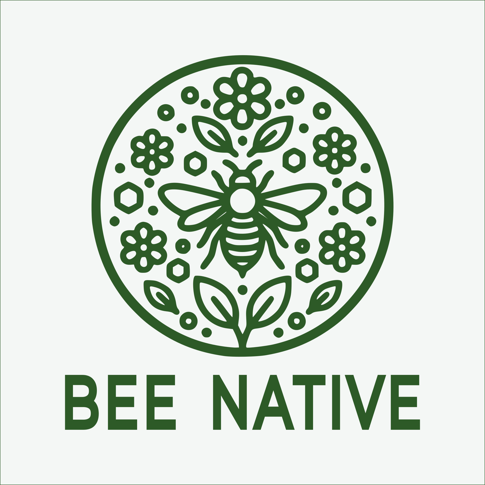

#  Bee Native

**Empowering North Carolinians to restore local ecosystems, one garden at a time.**

Welcome to Bee Native! Our goal is to provide you with accurate, useful, and quick-glance information about plants native to North Carolina to enable with education of native plants for gardners and native plant nuseries. This application is desiged for NC residents whom want a quick guide to understanding key gardening information about a plant. We make no such attempt to replace the high-quality field-botany plant identification guides provided by [UNC Chapel Hill Herbarium's FloraQuest](https://ncbg.unc.edu/research/unc-herbarium/flora-apps/). Rather we carefully gather and combine details from trusted botanical sources and provide a simplified lookup for garnders and NC plant nuseries. We are deeply grateful to the incredible curators of our data sources and recommend users interested in learning more about a particular plant to visit the cited sources.

---

## Primary Features

* **Verified Native Status:** Only "Native Taxa" as verified by the *Vascular Plants of North Carolina* are included.
* **"Smart" Mapping:** Complex botanical data is converted into standarized categories for sunlight, moisture, and height.
* **Wildlife Impact:** Identify plants that offer pollinator advantages, attract songbirds, or are resistant to deer.
* **Native Nusery Data:** Includes germination codes and life-cycle data for those starting gardens from seed.
* **Native Range Maps:** View official county-level maps showing exactly where each plant naturally grows in North Carolina.
* **PDF Catalog Creator:** Select a group of plants to generate a professional PDF guide for educating others on various native plants.

---

## Technical Details

Bee Native is built with a modern Python 3.10+ ecosystem:

* **Front-end:** [Flet](https://flet.dev)
* **Data Processing:** [Beautiful Soup](https://www.crummy.com/software/BeautifulSoup/) and [Polars](https://docs.pola.rs)
* **Database:** [SQLAlchemy](https://www.sqlalchemy.org/) with [alembic](https://alembic.sqlalchemy.org/en/latest/) migrations
* **Schema & Validation:** [Pydantic](https://docs.pydantic.dev/latest/)
* **PDF Export:** [ReportLab](https://www.reportlab.com/opensource/)

---

## Data Sources

We are deeply grateful to our primary data sources:

* [**Vascular Plants of North Carolina**](https://auth1.dpr.ncparks.gov/flora/index.php): This is our "source of truth" for confirming which plants are truly native to our state. Maintained by the [NC Biodiversity Project](https://nc-biodiversity.com/), this essential resource is a complete compendium of all vascular plant species, subspecies, and varieties known to exist in North Carolina.
* [**NC State Extension Gardener Plant Toolbox**](https://plants.ces.ncsu.edu/): This data offers a wealth of details, including research-backed **pollinator advantages** and **detailed attributes** ranging from soil pH preferences to salt tolerance. This data source was a driving inspiration for Bee Native, where we leverage a subset of their carefully curated information.
* [**Prairie Moon Nursery**](https://www.prairiemoon.com/): They offer a large collection of authentic, wild-type native plants, prioritizing original species over mass-market cultivars to preserve local genetics. For Bee Native users, Prairie Moon is our premier specialist for **germination codes**—essential for those starting their gardens from seed.
* [**Flora of the Southeastern United States**](https://fsus.ncbg.unc.edu/): Hosted by the North Carolina Botanical Garden, this world-class botanical resource allows us to provide high-quality, scientifically accurate imagery for our guide. For users seeking a deep-dive botanical experience, we highly recommend their [FloraQuest](https://ncbg.unc.edu/research/unc-herbarium/flora-apps/) app suite, which offers comprehensive field-guide tools for the entire southeastern region.

For additional details on how we filter and categorize this data, please see our [data guide](beenative/assets/static/README.md).

Copyright © 2026 Bee Native Team
